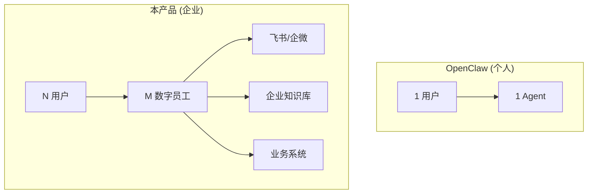
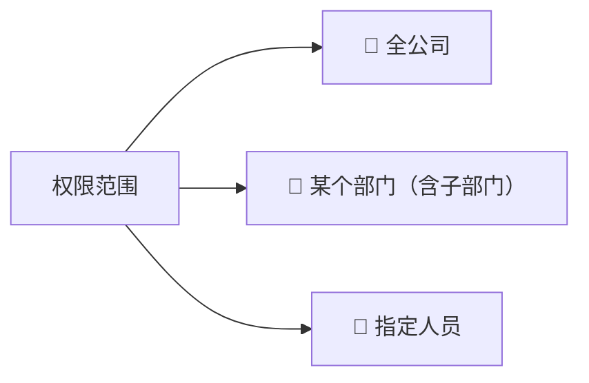
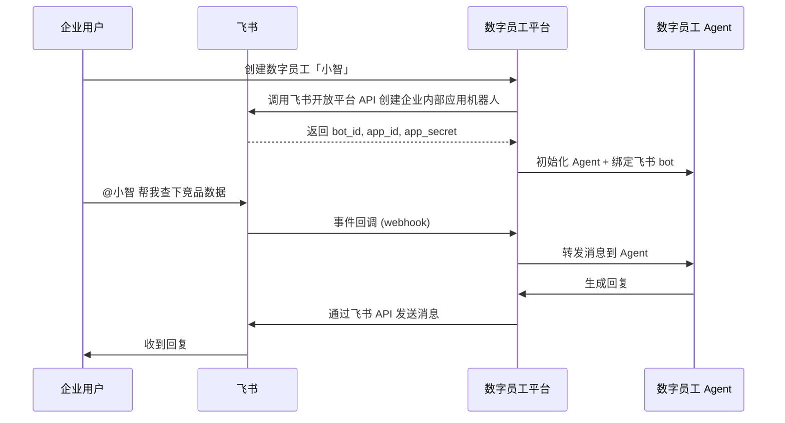
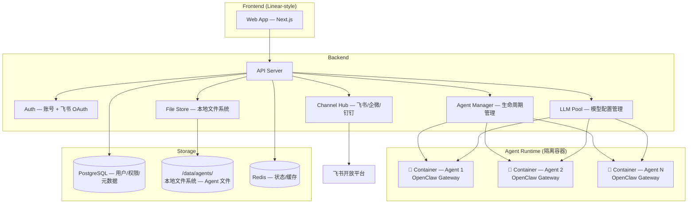
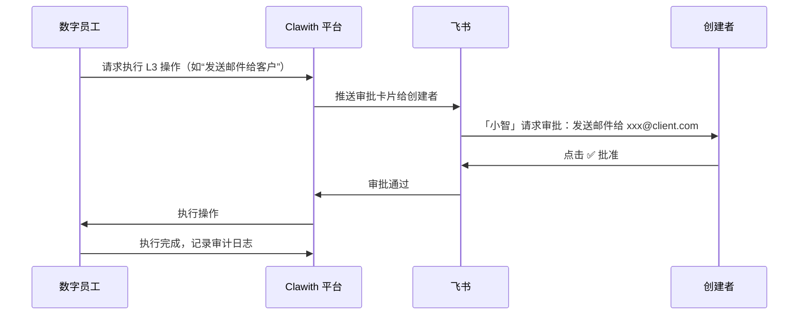

# Clawith — 企业数字员工平台 产品设计文档

> 基于 [OpenClaw](https://github.com/openclaw/openclaw) 架构，面向企业的多 Agent 管理平台
> 设计风格参考 [Linear](https://linear.app/)

---

## 1. 产品定位

**一句话**：Clawith 让企业中每个人都能创建、管理和使用自己的「数字员工」—— 一个有记忆、有技能、有待办、能通过聊天工具（当前是飞书）主动沟通协作的 AI Agent。

**与 OpenClaw 的关系**：
- OpenClaw = **单用户个人助理**（本地运行，单 Gateway，单 Workspace）
- Clawith = **企业多租户平台**（云端部署，多 Agent 实例，权限体系，组织架构感知）



---

## 2. 核心概念

| 概念 | 说明 |
|---|---|
| **数字员工 (Digital Employee)** | 一个独立的 Agent 实例，有自己的身份、记忆、技能和工作空间 |
| **创建者 (Creator)** | 创建数字员工的用户，自动成为该数字员工的管理员 |
| **使用者 (User)** | 被授权使用某个数字员工的企业成员 |
| **入职引导 (Onboarding)** | 创建者对新数字员工进行初始配置的过程（类比新员工入职培训） |
| **企业信息 (Enterprise Info)** | 平台级共享数据：组织架构、公司信息、知识库 |

---

## 3. 数字员工文件结构

每个数字员工创建时，从**初始化模板**复制一套完整的文件结构：

```
<agent_id>/
├── soul.md                        # 数字员工的人格、行为准则、角色定义
├── todo.json                      # 待办 & 督办任务
├── state.json                     # 当前状态（在线/忙碌/离线、当前任务等）
├── daily_report.md                # 每日工作日报
│
├── memory/                        # 记忆系统
│   ├── MEMORY_INDEX.md            # 记忆索引（可检索的记忆目录）
│   └── <topic>_memory.md          # 具体记忆文件（按主题组织）
│
├── skills/                        # 技能库
│   └── <skill_name>/
│       └── SKILL.md               # 技能定义文件
│
├── workspace/                     # 工作空间
│   ├── <task_folder>/             # 按任务组织的工作文件
│   └── archived/                  # 已归档的任务
│
└── enterprise_info/               # 企业信息（初始化时从平台同步）
    ├── org_structure.json          # 组织架构
    ├── company_profile.md          # 公司基本信息
    ├── systems_access.json         # 业务系统信息 & 数字员工账号凭证
    └── knowledge_base/             # 组织知识文档
```

### 3.1 关键文件详解

#### `soul.md`
```markdown
# Soul — [数字员工名称]

## Identity
- **名称**: 小智
- **角色**: 市场分析助手
- **创建者**: 张三
- **创建时间**: 2025-02-25

## Personality
- 严谨、数据驱动、主动汇报
- 遇到不确定的信息会主动确认

## Boundaries
- 不可修改财务数据
- 对外沟通需经过创建者审批
```

#### `todo.json`
```json
{
  "tasks": [
    {
      "id": "task_001",
      "title": "完成 Q1 竞品分析报告",
      "type": "todo",
      "status": "doing",
      "priority": "high",
      "assignee": "self",
      "created_by": "user_zhang3",
      "created_at": "2025-02-25T10:00:00+08:00",
      "due_date": "2025-02-28",
      "progress_log": [
        {
          "timestamp": "2025-02-25T14:30:00+08:00",
          "content": "已完成数据收集，正在撰写分析部分"
        }
      ]
    },
    {
      "id": "task_002",
      "title": "提醒李四提交本周周报",
      "type": "督办",
      "status": "pending",
      "督办_target": {
        "user_id": "user_li4",
        "user_name": "李四",
        "channel": "feishu"
      },
      "remind_schedule": "every Friday 16:00"
    }
  ]
}
```

#### `state.json`
```json
{
  "agent_id": "agent_xiaozhi_001",
  "name": "小智",
  "status": "working",
  "current_task": "task_001",
  "last_active": "2025-02-25T14:30:00+08:00",
  "channel_status": {
    "feishu": "online",
    "web": "online"
  },
  "stats": {
    "tasks_completed_today": 3,
    "tasks_in_progress": 1,
    "督办_pending": 2
  }
}
```

#### `enterprise_info/org_structure.json`

组织架构采用 **SCIM（System for Cross-domain Identity Management）** 风格的 JSON 结构，这是业界公认的身份和组织管理标准：

```json
{
  "schema": "scim-org-v1",
  "company": "数据项素",
  "departments": [
    {
      "id": "dept_001",
      "name": "产品研发部",
      "parent_id": null,
      "manager": { "user_id": "user_001", "name": "张三" },
      "members": [
        {
          "user_id": "user_001",
          "name": "张三",
          "title": "产品总监",
          "email": "zhang3@company.com",
          "feishu_id": "ou_xxx"
        }
      ],
      "children": ["dept_002", "dept_003"]
    }
  ]
}
```

---

## 4. 权限体系

### 4.1 角色定义

| 角色 | 权限 |
|---|---|
| **平台管理员** | 管理企业信息、组织架构、全局配置；可查看所有数字员工 |
| **创建者（即数字员工管理员）** | 创建/删除数字员工；设置使用权限范围；编辑所有文件 |
| **使用者** | 查看和编辑该数字员工的文件；下发任务；查看日报 |

### 4.2 使用权限范围

创建者为每个数字员工设置使用权限，支持三种范围：



权限范围基于组织架构树选择，UI 呈现为可展开的树形选择器。

### 4.3 补充权限建议

| 补充项 | 说明 |
|---|---|
| **数字员工命名** | 创建者可自定义名称、头像、简介 |
| **操作审计日志** | 记录谁在什么时间修改了什么 |
| **敏感操作审批** | 对外发送消息、访问业务系统时可配置审批流 |
| **Token 用量管控** | 每个数字员工可设置每日/每月 Token 用量上限 |
| **数字员工转让** | 创建者可将管理权转让给其他人 |
| **只读协作者** | 除「使用者」外，增加「只读」角色（只能查看，不能改） |

---

## 5. 用户界面设计

设计风格参考 Linear：深色主题、极简布局、键盘优先、流畅动画。

### 5.1 页面结构

```
┌──────────────────────────────────────────────────────┐
│  Sidebar                │  Main Content Area         │
│                         │                            │
│  🏠 Dashboard           │                            │
│  🤖 我的数字员工         │                            │
│    ├─ 小智 (🟢)         │                            │
│    ├─ 小文 (🟡)         │                            │
│    └─ 小策 (⚫)         │                            │
│  ➕ 新建数字员工         │                            │
│  ⚙️ 企业设置            │                            │
│  ──────────────         │                            │
│  🌐 中文 | EN           │                            │
│  👤 qinrui              │                            │
└──────────────────────────────────────────────────────┘
```

### 5.2 核心页面

#### A. Dashboard（用户面板）

卡片网格展示用户有权限的所有数字员工：

```
┌─────────────────┐  ┌─────────────────┐  ┌─────────────────┐
│  🤖 小智         │  │  🤖 小文         │  │  🤖 小策         │
│  市场分析助手    │  │  文档整理专员    │  │  战略规划顾问    │
│                  │  │                  │  │                  │
│  🟢 正在工作     │  │  🟡 等待指令     │  │  ⚫ 已停止       │
│  📋 进行中: 2    │  │  📋 进行中: 0    │  │  📋 进行中: 0    │
│  📌 督办: 3      │  │  📌 督办: 1      │  │  📌 督办: 0      │
│                  │  │                  │  │                  │
│  最后活跃: 5 分前 │  │  最后活跃: 2 小时 │  │  最后活跃: 3 天   │
└─────────────────┘  └─────────────────┘  └─────────────────┘
```

#### B. 数字员工详情页

左侧 Tab 导航 + 右侧内容区：

| Tab | 内容 |
|---|---|
| **Status** | `state.json` 的可视化呈现 — 状态灯、当前任务、通道状态、今日统计 |
| **Tasks** | 任务看板（4 列：Todo → Doing → 督办 → Done），Doing/督办/Done 可展开查看过程信息 |
| **Soul** | `soul.md` 的编辑器（Markdown 实时预览） |
| **Memory** | `memory/` 文件夹浏览 + MEMORY_INDEX.md |
| **Skills** | `skills/` 文件夹浏览 + 技能管理 |
| **Workspace** | `workspace/` 文件浏览器，可查看任务文件夹和归档 |
| **Daily Report** | `daily_report.md` 查看（支持按日期切换历史日报） |
| **Enterprise** | `enterprise_info/` 查看（只读或受限编辑） |
| **Settings** | 名称/头像/权限范围/通道配置/Token 用量 |

#### C. 新建数字员工 — 入职引导流程

分步引导（Wizard），Linear 风格：

```
Step 1: 基本信息  →  Step 2: 人格设定  →  Step 3: 技能配置  →  Step 4: 权限设置  →  Step 5: 通道绑定
━━━━━━━━━━●━━━━━━━━━━○━━━━━━━━━━○━━━━━━━━━━○━━━━━━━━━━○

📝 给你的数字员工起个名字

  名称:  [小智                    ]
  角色:  [市场分析助手              ]
  头像:  [🤖 选择或上传...]

                                          [下一步 →]
```

### 5.3 多语言支持

- 界面语言跟随用户设置，支持切换
- 初期支持：中文（默认）、English
- 所有 UI 文案通过 i18n 配置，数字员工内部文件语言由创建者决定

---

## 6. 聊天通道集成

当前默认支持飞书，通道层抽象为 `Channel` 接口以便未来扩展。

### 6.1 架构



### 6.2 实现要点

| 项目 | 方案 |
|---|---|
| **机器人创建** | 平台后端通过飞书开放平台 API 自动创建**企业自建应用**（Application Bot） |
| **消息收发** | 事件订阅（Webhook）接收消息 + 消息 API 发送回复 |
| **群组管理** | 数字员工可被拉入群聊、在群中被 @ 时响应 |
| **身份打通** | 飞书 OAuth 登录平台（SSO），飞书 `open_id` 与平台 `user_id` 映射 |
| **审批流** | 敏感操作可触发飞书审批，审批通过后继续执行 |

### 6.3 飞书登录

- 平台支持两种登录方式：
  1. **账号密码注册/登录**
  2. **飞书 OAuth SSO 登录**（通过飞书开放平台 OAuth 2.0 授权码模式）
- 首次飞书登录时自动创建平台账号并关联

### 6.4 平台管理员 — 通道配置页

平台管理员需要在「企业设置 → 通道配置」中配置飞书平台凭证后，数字员工才能自动创建飞书机器人。

**配置项：**

| 字段 | 说明 | 必填 |
|---|---|---|
| **App ID** | 飞书开放平台企业自建应用的 App ID | ✅ |
| **App Secret** | 飞书开放平台企业自建应用的 App Secret | ✅ |
| **Encrypt Key** | 事件订阅加密密钥（飞书安全配置） | ✅ |
| **Verification Token** | 事件订阅验证令牌 | ✅ |
| **Webhook URL** | 平台自动生成，管理员需将此 URL 回填至飞书后台的事件订阅配置 | 自动生成 |
| **权限范围** | 提示管理员需在飞书后台开启的 API 权限列表 | 引导提示 |

**配置流程引导：**

```
┌────────────────────────────────────────────────────────────┐
│  ⚙️ 通道配置 — 飞书                                        │
│                                                            │
│  📋 配置步骤：                                              │
│  1. 登录飞书开放平台 (open.feishu.cn) 创建企业自建应用       │
│  2. 在应用中开启「机器人」能力                               │
│  3. 将以下凭证填入：                                        │
│                                                            │
│     App ID:          [_____________________________]       │
│     App Secret:      [_____________________________]  👁   │
│     Encrypt Key:     [_____________________________]  👁   │
│     Verification:    [_____________________________]       │
│                                                            │
│  4. 将以下 Webhook URL 填入飞书后台事件订阅：                │
│     https://your-domain.com/api/channel/feishu/webhook     │
│                                                   [📋复制] │
│                                                            │
│  5. 在飞书后台开启以下权限：                                 │
│     ☑ im:message        ☑ im:chat         ☐ contact:user  │
│     ☑ im:message:send   ☑ im:chat:create  ☐ approval      │
│                                                            │
│  状态: 🟢 已连接  |  最后测试: 2025-02-25 17:00             │
│                                                            │
│                          [测试连接]  [保存配置]             │
└────────────────────────────────────────────────────────────┘
```

> 配置完成后，每次创建数字员工时平台使用此凭证自动为其创建对应的飞书机器人身份。

### 6.5 未来扩展

通道层抽象为 `Channel` 接口，飞书是第一个实现。后续可扩展：

| 通道 | 优先级 |
|---|---|
| 飞书（Feishu/Lark） | P0 — 首发 |
| 企业微信（WeCom） | P1 |
| 钉钉（DingTalk） | P2 |
| Slack | P3 |

每种通道在「企业设置 → 通道配置」中有独立的配置 Tab。

---

## 7. 我的补充建议

以下是你没有明确提到、但我认为值得加入的能力：

### 7.1 数字员工协作（Agent-to-Agent）

OpenClaw 已支持 `sessions_*` 工具实现 Agent 间通信。企业场景下更需要：

- 数字员工间可互相发消息、委派任务
- 例：「小智」让「小策」帮忙查一份数据，「小策」完成后回传结果
- UI 上展示协作关系图

### 7.2 数字员工模板市场

- 预置常用角色模板：市场分析师、HR 助手、IT 运维、项目管理等
- 管理员可创建企业内部模板
- 创建时可选择「空白」或「从模板创建」

### 7.3 工作交接

- 数字员工可以被「暂停」和「恢复」
- 创建者离职时，管理员可将数字员工转让给其他人
- 所有记忆和任务历史保留

### 7.4 安全沙箱

参考 OpenClaw 的 sandbox 模式：
- 数字员工操作业务系统时在隔离容器中运行
- 文件操作限制在 workspace 范围内
- 网络访问白名单

### 7.5 可观测性

- **Token 用量仪表盘**：按数字员工/部门/时段统计
- **任务完成率追踪**：数字员工的 KPI
- **异常告警**：数字员工长时间无响应、Token 接近上限等
- **操作回放**：关键操作可回溯

### 7.6 企业知识同步

- `enterprise_info/` 中的公司信息由平台管理员统一维护
- 一处修改 → 自动同步到所有数字员工的 `enterprise_info/`
- 支持按数字员工角色差异化推送（如 HR 助手能看到薪资体系，市场助手看不到）

---

## 8. 技术架构概览

### 8.1 架构决策

| 决策项 | 方案 | 理由 |
|---|---|---|
| **Agent 运行隔离** | 每个数字员工独立 OpenClaw Gateway 进程（Docker 容器） | 安全隔离优先，互不影响 |
| **文件存储** | 本地文件系统（每个 Agent 独立目录） | 简单可靠，后续可迁移到对象存储 |
| **LLM 配置** | 平台管理员统一配置可选模型池，每个数字员工从池中选择 | 统一管控 + 灵活选择 |

### 8.2 架构图



### 8.3 LLM 模型管理

**平台管理员**在「企业设置 → 模型配置」中配置可用模型池：

```json
{
  "llm_pool": [
    {
      "id": "claude-opus",
      "provider": "anthropic",
      "model": "claude-opus-4-6",
      "api_key": "sk-***",
      "label": "Claude Opus 4.6 (推荐)",
      "max_tokens_per_day": 1000000,
      "enabled": true
    },
    {
      "id": "gpt-4o",
      "provider": "openai",
      "model": "gpt-4o",
      "api_key": "sk-***",
      "label": "GPT-4o",
      "enabled": true
    },
    {
      "id": "deepseek-r1",
      "provider": "deepseek",
      "model": "deepseek-reasoner",
      "api_key": "sk-***",
      "label": "DeepSeek R1",
      "enabled": true
    }
  ]
}
```

**数字员工创建者/使用者**在数字员工 Settings 页选择使用哪个模型：
- 主模型（日常对话 & 任务执行）
- 备选模型（主模型不可用时自动切换）

---

## 9. 产品命名

✅ **确认：Clawith**

Crew = 班组/团队，直观表达「一支数字员工团队」的概念。延续 OpenClaw 的 Claw 品牌，读起来顺、好记、有企业感。

---

## 10. 已确认的架构决策

| # | 问题 | 决策 |
|---|---|---|
| 1 | 数字员工运行环境 | ✅ **独立容器隔离** — 每个 Agent 独立 OpenClaw Gateway 进程，Docker 容器化，安全性优先 |
| 2 | 文件存储 | ✅ **本地文件系统优先** — 每个 Agent 独立目录（`/data/agents/<agent_id>/`），后续可迁移到对象存储 |
| 3 | LLM 配置 | ✅ **平台统一配置模型池 + 每个数字员工独立选择** — 管理员管控成本和模型范围，使用者灵活选配 |
| 4 | 数字员工自主性边界 | ✅ **三级自主性模型**（见下方详细设计） |
| 5 | MVP 范围 | 🟡 待讨论 |

### 10.1 数字员工自主性边界 — 三级模型

创建者可为每个数字员工的不同操作类型配置自主性级别：

| 级别 | 名称 | 说明 | 适用场景示例 |
|---|---|---|---|
| **L1** | 🟢 自主执行 | 数字员工直接执行，不需人类介入 | 读取文件、搜索信息、整理资料、编写文档、回复常规问题 |
| **L2** | 🟡 知会创建者 | 数字员工执行后通知创建者（通过飞书消息） | 发送督办提醒、修改工作区文件、调用内部系统查询接口 |
| **L3** | 🔴 需审批 | 数字员工提交审批请求，创建者批准后才执行 | 对外发送消息、操作业务系统写入、删除文件、资金相关操作 |

**默认策略（初始模板）：**

```json
{
  "autonomy_policy": {
    "read_files": "L1",
    "write_workspace_files": "L2",
    "send_feishu_message": "L2",
    "send_external_message": "L3",
    "modify_soul": "L3",
    "access_business_system_read": "L2",
    "access_business_system_write": "L3",
    "delete_files": "L3",
    "create_calendar_event": "L2",
    "financial_operations": "L3"
  }
}
```

**审批流程：**



创建者可在数字员工 **Settings → 自主性配置** 中调整每个操作类型的级别。
